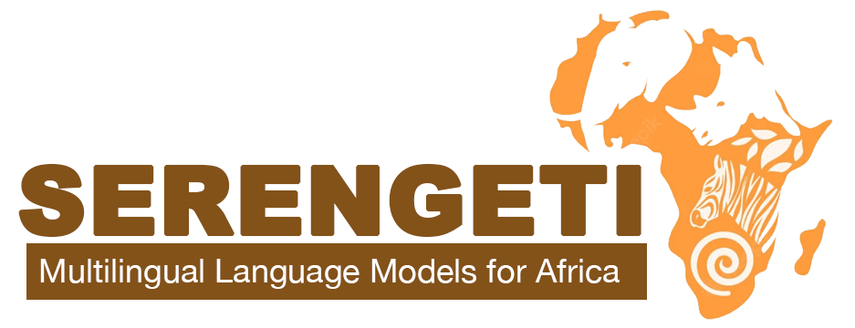
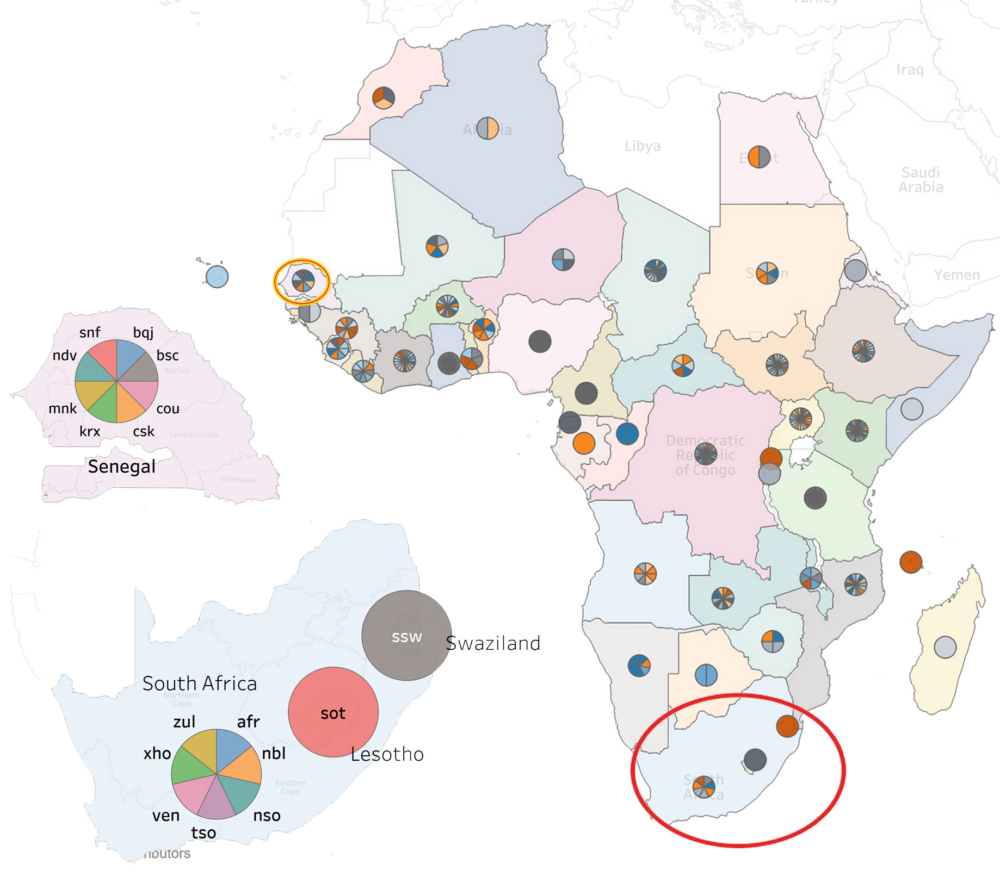

<p align="center">
    <br>
    
    <br>
<p>

<p align="center">
<a href="https://huggingface.co/UBC-NLP/serengeti">
        
    </a>
<a href="https://github.com/UBC-NLP/serengeti/stargazers"></a>
<a href="https://github.com/UBC-NLP/serengeti/network"></a>

</p>
 

<div style='text-align: justify;'>
Multilingual pretrained language models (mPLMs) acquire valuable, generalizable linguistic information during pretraining and have advanced the state of the art on task-specific finetuning. 
<br><br>
To date, only ~31 out of 2,000 African languages are covered in existing language models. We ameliorate this limitation by developing <b>SERENGETI</b>, a set of massively multilingual language model that covers 517 African languages and language varieties. We evaluate our novel models on eight natural language understanding tasks across 20 datasets, comparing to 4 mPLMs that cover 4-23 African languages. 
<br><br>
<b>SERENGETI</b> outperforms other models on 11 datasets across eights tasks, achieving 82.27 average F<sub>1</sub>-score. We also perform analyses of errors from our models, which allows us to investigate the influence of language genealogy and linguistic similarity when the models are applied under zero-shot settings. We will publicly release our models for research.
</div>

## Table of Contents
- [1 Our Language Models](#1-Our-Language-Models)
  - [1.1 Training Data](#11-training-data)
  - [1.2 Models Architecture](#12-models-architecture)
  - [1.3 Serengeti Models](#13-serengeti-models)
- [2. AfroNLU Benchmark and Evaluation](#2-our-benchmark-AfroNLU)
  - [2.1 Named Entity Recognition](#21-named-entity-recognition)
  - [2.2 Phrase Chuncking](#22-phrase-chuncking)
  - [2.3 Part of Speech Tagging](#23-part-of-speech-tagging)
  - [2.4 News Classification](#24-news-classification)
  - [2.5 Sentiment Analysis](#25-sentiment-analysis)
  - [2.6 Topic Classification](#26-topic-classification)
  - [2.7 Question Answering](#27-question-answering)
  - [2.8 Language Identification](#28-language-identification) 
- [3. How to use Serengeti model](#3-how-to-use-serengeti-model)
- [4. Ethics](#4-ethics)
- [5. Citation](#6-citation)
- [6. Acknowledgments](#7-acknowledgments)

## 1. Our Language Models
## 1.1 Training Data

* **Serengeti Training Data**: SERENGETI is pretrained using 42GB of data comprising a multi-domain, multi-script collection. The multi-domain dataset comprises texts from religious, news, government documents, health documents, and existing corpora written in five scripts from the set {Arabic, Coptic, Ethiopic, Latin, and Vai}. 
* Religious Domain. Our religious data is taken from online Bibles, Qurans, and data crawled from the Jehovah’s witness website. We also include religious texts from the book of Mormon.
* News Domain. We collect data from online newspapers [(Adebara and Abdul-Mageed, 2022)](https://aclanthology.org/2022.acl-long.265/) and news sites such as [(Voice of America)](https://www.voanews.com/navigation/allsites), [(Voice of Nigeria)](https://von.gov.ng/), [(BBC)](https://www.bbc.com/news), [(Global voices)](https://globalvoices.org/), and [(DW)](https://www.dw.com/en/top-stories/s-9097) news sites. We collect local newspapers from 27 languages from across Africa.
* Government Documents. We collect government documents South African Centre for Digital Language Resources [(SADiLaR)](https://www.sadilar.org/), and the Universal Declaration of human rights [(UDHR)](https://www.un.org/en/about-us/universal-declaration-of-human-rights) in multiple languages.
* Health Documents. We collect multiple health documents from the Department of Health, State Government of Victoria, Australia. We collect documents in Amharic, Dinka, Harari, Oromo, Somali, Swahili, and Tigrinya.
* Existing Corpora. We collect corpora available on the web for different African languages, including from Project Gutenberg for Afrikaans, South African News data. for Sepedi and Setswana, OSCAR (Abadji et al., 2021) for Afrikaans, Amharic, Somali, Swahili, Oromo, Malagasy, and Yoruba. We also used Tatoeba for Afrikaans, Amharic, Bemba, Igbo, Kanuri, Kongo, Luganda, Malagasy, Sepedi, Ndebele, Kinyarwanda, Somali, Swahili, Tsonga, Xhosa, Yoruba, and Zulu; Swahili Language Modelling Data for Swahili; Ijdutse corpus for Hausa; Data4Good corpora for Luganda, CC-100 for Amharic, Fulah, Igbo, Yoruba, Hausa, Tswana, Lingala, Luganada, Afrikaans, Somali, Swahili, Swati, North Sotho, Oromo, Wolof, Xhosa, and Zulu; Afriberta-Corpus for Afaan / Oromo, Amharic, Gahuza, Hausa, Igbo, Pidgin, Somali, Swahili, Tigrinya and Yoruba; mC4 for Afrikaans, Amharic, Hausa, Igbo, Malagasy, Chichewa, Shona, Somali, Sepedi, Swahili, Xhosa, Yoruba and Zulu.

## 1.2 Models Architecture

To train our Serengeti, we use the same architecture as ```Electra``` [(Chi etal, 2022)](https://aclanthology.org/2022.acl-long.427/) and  ```XLMR``` [(Conneau etal, 2020)](https://aclanthology.org/2020.acl-main.747/). We experiment with different vocabulary sizes for the Electra models and name them Serengeti-E110 and Serengeti-E250 with 110K and 250K respectively. Each of these models has 12 layers and 12 attention heads. We pretrain each model for 40 epochs with a sequence length of 512, a learning rate of 2e − 4 and a batch size of 216 and 104 for the SERENGETI-E110 and SERENGETI-E250, respectively. We train the XLMR-base model, which we refer to henceforth as Serengeti with a 250K vocabulary size for 20 epochs. This model has 12 layers and 12 attention heads, a sequence length of 512 and a batch size of 8. Serengeti outperforms both Electra models. 

## 1.3.  Serengeti Models 

Serengeti Pytorch and Tenserflow checkpoints are available on Huggingface website for direct download and use ```exclusively for research```. `For commercial use, please contact the authors via email @ (*muhammad.mageed[at]ubc[dot]ca*).`

| **Model**   | **Link** | 
|---------|:------------------:|
| **Serengeti-E110**: Electra with 100k vocabulary size  |     [https://huggingface.co/UBC-NLP/Serengeti](https://huggingface.co/UBC-NLP/serengeti-E110/tree/main)     |     
| **Serengeti-E250**: Electra with 250k vocabulary size  |   [https://huggingface.co/UBC-NLP/Serengeti](https://huggingface.co/UBC-NLP/serengeti-E250/tree/main)    |      
| 🔥**Serengeti**🔥: XLMR-base model|     [https://huggingface.co/UBC-NLP/Serengeti](https://huggingface.co/UBC-NLP/serengeti/tree/main)       | 


## 2. AfroNLU Benchmark and Evaluation
AfroNLU is composed of seven different tasks, covering both token and sentence level tasks, across 18 different datasets. The benchmark covers a total of 32 different languages and language varieties. n addition we evaluate our best model (SERENGETI) on an African language identification (LID) task covering all the 517 languages in our pretraining collection. For LID, we use two datasets to test SERENGETI. This puts AfroNLU at a total of 20 different datasets and eight different tasks.
AfroNLU includes the following tasks: ```named entity recognition```,  ```phrase chuncking```,  ```part of speech tagging```, ```news classification```, ```sentiment analysis```,  ```topic classification```,  ```question answering``` and ```language identification```.

### 2.1 
#### 2.1  Named Entity Recognition

| **Dataset**  |  **XLMR** | **mBERT** | **Afro-XLMR** | **AfriBERTa** |  **SERENGETI-E110** | **SERENGETI-E250** |  **SERENGETI** | 
|----------------|:---------:|:-------------:|:-----------:|:----------:|:----------:|:-----------:|:-----------:|
|  MasakaNER-v1 [Ifeoluwa Adelani et al., 2021](https://direct.mit.edu/tacl/article/doi/10.1162/tacl_a_00416/107614/MasakhaNER-Named-Entity-Recognition-for-African)                   |81.41<sup>±0.26</sup> |78.57<sup>±0.53</sup> |84.16<sup>±0.45</sup> |81.42<sup>±0.30</sup> |81.23<sup>±0.32</sup> |81.54<sup>±0.68</sup> |**84.53<sup>±0.56</sup>** |
|  MasakaNER-v2 [Ifeoluwa Adelani et al., 2022](https://aclanthology.org/2022.emnlp-main.298/)    |87.17<sup>±0.18</sup> |84.82<sup>±0.96</sup>  |88.69<sup>±0.12</sup> |86.22<sup>±0.06</sup>  |86.57<sup>±0.27</sup> |86.69<sup>±0.29</sup> |**88.86<sup>±0.25</sup>** |      
|  MasakaNER-east    [Ifeoluwa Adelani et al., 2021](https://direct.mit.edu/tacl/article/doi/10.1162/tacl_a_00416/107614/MasakhaNER-Named-Entity-Recognition-for-African)                                     | 80.38<sup>±0.56</sup> | 78.33<sup>±1.25</sup> |  83.02<sup>±0.31</sup> |  79.31<sup>±0.92</sup> | 80.53<sup>±0.71</sup> | 81.26<sup>±0.68</sup> | **83.75<sup>±0.26</sup>** |       
|  MasakaNER-eastwest  [Ifeoluwa Adelani et al., 2021](https://direct.mit.edu/tacl/article/doi/10.1162/tacl_a_00416/107614/MasakhaNER-Named-Entity-Recognition-for-African) | 82.85<sup>±0.38</sup> | 82.37<sup>±0.90</sup> | **86.31<sup>±0.30</sup>**  | 82.98<sup>±0.44</sup> |  82.90<sup>±0.49</sup> | 83.67<sup>±0.44</sup> | 85.94<sup>±0.27</sup> |      
|  MasakaNER-west⋆   [Ifeoluwa Adelani et al., 2021](https://direct.mit.edu/tacl/article/doi/10.1162/tacl_a_00416/107614/MasakhaNER-Named-Entity-Recognition-for-African) | 82.85<sup>±0.79</sup> | 83.99<sup>±0.39</sup>  | **86.78<sup>±0.44</sup>** | 84.08<sup>±0.32</sup>  | 82.06<sup>±0.67</sup> | 83.45<sup>±0.81</sup> | 86.27<sup>±0.94</sup> |      
|  NCHLT-NER     [(SADiLaR)](https://www.sadilar.org/)| 71.41<sup>±0.07</sup> | 70.58<sup>±0.26</sup>  | 72.27<sup>±0.14</sup>  | 68.74<sup>±0.29</sup>  | 64.46<sup>±0.37</sup> | 64.42<sup>±0.24</sup> | **73.18<sup>±0.24</sup>** |       
|  Yoruba-Twi-NER  [Alabi et al., 2020](https://aclanthology.org/2020.lrec-1.335/)     | 61.18<sup>±2.19</sup> |  70.37<sup>±0.61</sup>  | 58.48<sup>±1.85</sup>  | 69.24<sup>±3.05</sup> | 61.77<sup>±1.24 | 57.99<sup>±2.61</sup> | **71.25<sup>±1.73</sup>** | 
|  WikiAnn  [(Pan et al.2017; Rahimi et al., 2019)](https://aclanthology.org/P19-1015/)     | 83.82<sup>±0.39</sup> | 82.65<sup>±0.77</sup> | 86.01<sup>±0.83</sup>  | 83.05<sup>±0.20</sup> | 83.17<sup>±0.54</sup> | 84.85<sup>±0.53</sup> | **85.83<sup>±0.94</sup>** | 

Metric is F1. 

#### 2.2  Phrase Chuncking

| **Dataset**  |  **XLMR** | **mBERT** | **Afro-XLMR** | **AfriBERTa** |  **SERENGETI-E110** | **SERENGETI-E250** |  **SERENGETI** | 
|----------------|:---------:|:-------------:|:-----------:|:----------:|:----------:|:-----------:|:-----------:|
|  Phrase-Chunk [(SADiLaR)](https://www.sadilar.org/)                  | 88.86<sup>±0.18</sup> | 88.65<sup>±0.06</sup> | 90.12<sup>±0.12</sup> | 87.86<sup>±0.20</sup> | 90.39<sup>±0.21</sup> | 89.93<sup>±0.33</sup> | **90.51<sup>±0.04</sup>** |

Metric is F1. 

#### 2.3  Part of Speech Tagging

| **Dataset**  |  **XLMR** | **mBERT** | **Afro-XLMR** | **AfriBERTa** |  **SERENGETI-E110** | **SERENGETI-E250** |  **SERENGETI** | 
|----------------|:---------:|:-------------:|:-----------:|:----------:|:----------:|:-----------:|:-----------:|
|  POS-tagging [(Onyenwe et al., 2018,2019)](https://dl.acm.org/doi/10.1145/3146387)                 | 85.50<sup>±0.08</sup>  |  85.42<sup>±0.13</sup>  | 85.39<sup>±0.21</sup> | 85.43<sup>±0.05</sup> | 85.50<sup>±0.16</sup> | **85.61<sup>±0.13</sup>** | 85.54<sup>±0.08</sup> |
     
Metric is F1. 

#### 2.4  News Classification

| **Dataset**  |  **XLMR** | **mBERT** | **Afro-XLMR** | **AfriBERTa** |  **SERENGETI-E110** | **SERENGETI-E250** |  **SERENGETI** | 
|----------------|:---------:|:-------------:|:-----------:|:----------:|:----------:|:-----------:|:-----------:|
|  Amharic News [(Azime and Mohammed, 2021)](https://arxiv.org/abs/2103.05639)    | 84.97<sup>±0.55</sup> |  59.01<sup>±1.47</sup> | 86.18<sup>±0.85</sup> | 86.54<sup>±1.20</sup> |  86.50<sup>±0.71</sup> | 86.34<sup>±0.30</sup> | **86.82<sup>±0.72</sup>** |
|  Kinnews [(Niyongabo et al., 2020)](https://aclanthology.org/2020.coling-main.480/)     | 76.58<sup>±0.70</sup> |  77.45<sup>±0.43</sup> | 79.13<sup>±0.53</sup> | 80.40<sup>±1.50</sup> | **81.43<sup>±1.02</sup>** | 80.38<sup>±1.36</sup> | 79.80<sup>±0.68</sup> |
|  Kirnews [(Niyongabo et al., 2020)](https://aclanthology.org/2020.coling-main.480/)     | 57.18<sup>±3.44</sup> |  74.71<sup>±2.56</sup> | 87.67<sup>±0.92</sup> | **89.59<sup>±0.27</sup>** | 78.75<sup>±3.24</sup> | 86.60<sup>±1.28</sup> |  87.53<sup>±2.31</sup> |
|  Swahili News V.0.2 [(David, 2020a,b)](https://dl.acm.org/doi/10.1145/3146387)     | 87.50<sup>±0.91</sup> |  85.12<sup>±0.93</sup> | 87.49<sup>±1.26</sup> | 87.91<sup>±0.36</sup> | 87.33<sup>±0.28</sup> |  86.12<sup>±1.30</sup> |  **88.24<sup>±0.99</sup>** |

Metric is F1

#### 2.5  Sentiment Analysis

| **Dataset**  |  **XLMR** | **mBERT** | **Afro-XLMR** | **AfriBERTa** |  **SERENGETI-E110** | **SERENGETI-E250** |  **SERENGETI** | 
|----------------|:---------:|:-------------:|:-----------:|:----------:|:----------:|:-----------:|:-----------:|
|  Bambara-V1 [(Diallo et al., 2021)](https://arxiv.org/abs/2108.02524)    | 47.17<sup>±1.83</sup> |  64.56<sup>±1.71</sup> | 59.40<sup>±0.56</sup> | 65.06<sup>±2.08</sup> |  65.07<sup>±2.59</sup> | **65.76<sup>±2.02</sup>** | 63.36<sup>±3.31</sup> |
|  Pidgin Tweet [(Oyewusi et al., 2020)](https://arxiv.org/abs/2003.12450v1)     | 70.42<sup>±0.68</sup> |  68.59<sup>±0.47</sup> | **71.40<sup>±0.51</sup>** | 69.19<sup>±0.97</sup> | 71.06<sup>±0.39</sup> | 70.46<sup>±1.02</sup> | 69.74<sup>±0.92</sup> |
|  YOSM [(Shode et al., 2022)](https://arxiv.org/abs/2204.09711)     | 85.57<sup>±1.09</sup> |  85.25<sup>±0.25</sup> | 87.46<sup>±0.42</sup> | 88.66<sup>±0.23</sup> | 86.86<sup>±0.95</sup> | 85.58<sup>±1.51</sup> | **87.86<sup>±0.81</sup>** |

Metric is F1

#### 2.6  Topic Classification

| **Dataset**  |  **XLMR** | **mBERT** | **Afro-XLMR** | **AfriBERTa** |  **SERENGETI-E110** | **SERENGETI-E250** |  **SERENGETI** | 
|----------------|:---------:|:-------------:|:-----------:|:----------:|:----------:|:-----------:|:-----------:|
|  Hausa-Topic [(Hedderich et al., 2020)](https://aclanthology.org/2020.emnlp-main.204/)    | 85.80<sup>±1.45</sup> |  81.38<sup>±0.42</sup> | 88.67<sup>±0.30</sup> | **92.59<sup>±0.69</sup>**|  88.52<sup>±1.31</sup> | 89.07<sup>±0.95</sup> | 89.93<sup>±0.49</sup> |
|  Yoruba-Topic [(Hedderich et al., 2020)](https://aclanthology.org/2020.emnlp-main.204/)   | 54.69<sup>±2.89</sup> |  71.79<sup>±1.43</sup> | 75.13<sup>±1.40</sup> | **81.79<sup>±0.66** | 65.22<sup>±4.72</sup> | 66.34<sup>±4.09</sup> | 79.87<sup>±1.61</sup> |     
      
Metric is F1

#### 2.7  Question Answering

| **Dataset**  |  **XLMR** | **mBERT** | **Afro-XLMR** | **AfriBERTa** |  **SERENGETI-E110** | **SERENGETI-E250** |  **SERENGETI** | 
|----------------|:---------:|:-------------:|:-----------:|:----------:|:----------:|:-----------:|:-----------:|
|  QA-Swahili [ (Clark et al., 2020a)](https://direct.mit.edu/tacl/article/doi/10.1162/tacl_a_00317/96451/TyDi-QA-A-Benchmark-for-Information-Seeking)    | 82.79<sup>±1.93</sup> |  **83.40<sup>±0.78</sup>** | 79.94<sup>±0.39</sup> | 57.3<sup>±1.8</sup> |  79.76<sup>±0.52</sup> | 81.25<sup>±1.33</sup> | 80.01<sup>±0.78</sup> |

Metric is F1

#### 2.8  Language Identification
We evaluate only Serengeti on the language identification datasets listed below and compare the results with AfroLID:

| **Dataset**  |  **AfroLID** | **Serengeti** | 
|----------------|:---------:|:-------------:|
|  AfroLID [(Adebara et al., 2022b)](https://aclanthology.org/2022.emnlp-main.128.pdf)    | 96.14 | **97.64<sup>±0.02</sup>** |

| **Dataset**  |  **Split** | **AfroLID** | **Serengeti** | 
|----------------|:---------:|:-------------:|:---------:|
|  AfriSenti [(Muhammad et al., 2022; Yimam et al., 2020)](https://arxiv.org/abs/2201.08277) | Amharic (amh) | 97.00 |  **99.50<sup>±0.01</sup>** |
|  AfriSenti [(Muhammad et al., 2022; Yimam et al., 2020)](https://arxiv.org/abs/2201.08277) | Hausa (hau)  | 89.00 |  **98.09<sup>±0.02</sup>** |
|  AfriSenti [(Muhammad et al., 2022; Yimam et al., 2020)](https://arxiv.org/abs/2201.08277) | Igbo  (ibo) | 46.00 | **95.28<sup>±0.00</sup>** |
|  AfriSenti [(Muhammad et al., 2022; Yimam et al., 2020)](https://arxiv.org/abs/2201.08277) | Nigerian Pidgin (pcm)   | 56.00 |  **77.73<sup>±0.01</sup>** |
|  AfriSenti [(Muhammad et al., 2022; Yimam et al., 2020)](https://arxiv.org/abs/2201.08277) | Swahili (swh)  | 96.00 |  **98.66<sup>±0.02</sup>** |
|  AfriSenti [(Muhammad et al., 2022; Yimam et al., 2020)](https://arxiv.org/abs/2201.08277) | Yoruba (yor) | 82.00 |  **98.96<sup>±0.00</sup>** |
Metric is F1

#  3. How to use Serengeti model

Below is an example for using **Serengeti** predict masked tokens. 
``` bash
from transformers import AutoTokenizer, AutoModelForMaskedLM

tokenizer = AutoTokenizer.from_pretrained("UBC-NLP/serengeti", use_auth_token="XXX")

model = AutoModelForMaskedLM.from_pretrained("UBC-NLP/serengeti", use_auth_token="XXX")
from transformers import pipeline

classifier = pipeline("fill-mask", model=model, tokenizer=tokenizer)
classifier("ẹ jọwọ , ẹ <mask> mi") #Yoruba
[{'score': 0.07887924462556839,
  'token': 8418,
  'token_str': 'ọmọ',
  'sequence': 'ẹ jọwọ, ẹ ọmọ mi'},
 {'score': 0.04658124968409538,
  'token': 156595,
  'token_str': 'fẹ́ràn',
  'sequence': 'ẹ jọwọ, ẹ fẹ́ràn mi'},
 {'score': 0.029315846040844917,
  'token': 204050,
  'token_str': 'gbàgbé',
  'sequence': 'ẹ jọwọ, ẹ gbàgbé mi'},
 {'score': 0.02790883742272854,
  'token': 10730,
  'token_str': 'kọ',
  'sequence': 'ẹ jọwọ, ẹ kọ mi'},
 {'score': 0.022904086858034134,
  'token': 115382,
  'token_str': 'bẹ̀rù',
  'sequence': 'ẹ jọwọ, ẹ bẹ̀rù mi'}]

```

For the more details please read this notebook [](https://github.com/UBC-NLP/serengeti/blob/main/Serengeti_notebook.ipynb) 

## 4. Ethics
 
Serengeti aligns with Afrocentric NLP where the needs of African people is put into consideration when developing technology. We believe Serengeti will not only be useful to speakers of the languages supported, but also researchers of African languages such as anthropologists and linguists. We discuss below some use cases for Serengeti and offer a number of broad impacts.
- Serengeti aims to address the lack of access to technology in about 90\% of the world's languages, which automatically discriminates against native speakers of those languages. More precisely, it does so by focusing on Africa. To the best of our knowledge, Serengeti is the first massively multilingual PLM developed for African languages and language varieties. A model with knowledge of 517 African languages, is by far the largest to date for African NLP. 
- Serengeti enables improved access of important information to the African community in Indigenous African languages. This is especially beneficial for people who may not be fluent in other languages. This will potentially connect more people globally. 
- Serengeti affords opportunities for language preservation for many African languages. To the best of our knowledge, Serengeti consists of languages that have not been used for any NLP task until now. We believe that it can help encourage  continued use of these languages in several domains, as well as trigger future development of language technologies for many of these languages.
- To mitigate discrimination and bias, we adopt a manual curation of our datasets. Native speakers of Afrikaans, Yorùbá, Igbo, Hausa, Luganda, Kinyarwanda, Chichewa, Shona, Somali, Swahili, Xhosa, Bemba, and Zulu also manually evaluated a subset of the data to ensure its quality. The data collected for this work is taken from various domains to further ensure a better representation of the language usage of native speakers.
- Although LMs are useful for a wide range of applications, they can also be misused. Serengeti is developed using publicly available datasets that may carry biases. Although we strive to perform analyses and diagnostic case studies to probe performance of our models, our investigations are by no means comprehensive nor guarantee absence of bias in the data. In particular, we do not have access to native speakers of most of the languages covered. This hinders our ability to investigate samples from each (or at least the majority) of the languages.

## Citation
If you use the pre-trained model (Serengeti) for your scientific publication, or if you find the resources in this repository useful, please cite our paper as follows (to be updated):
```
@inproceedings{adebara-etal-2023-serengeti,
    title = "{SERENGETI}: Massively Multilingual Language Models for {A}frica",
    author = "Adebara, Ife  and
      Elmadany, AbdelRahim  and
      Abdul-Mageed, Muhammad  and
      Alcoba Inciarte, Alcides",
    booktitle = "Findings of the Association for Computational Linguistics: ACL 2023",
    month = jul,
    year = "2023",
    address = "Toronto, Canada",
    publisher = "Association for Computational Linguistics",
    url = "https://aclanthology.org/2023.findings-acl.97",
    doi = "10.18653/v1/2023.findings-acl.97",
    pages = "1498--1537",
}

```

## Acknowledgments
We gratefully acknowledges support from Canada Research Chairs (CRC), the Natural Sciences and Engineering Research Council of Canada (NSERC; RGPIN-2018-04267), the Social Sciences and Humanities Research Council of Canada (SSHRC; 435-2018-0576; 895-2020-1004; 895-2021-1008), Canadian Foundation for Innovation (CFI; 37771), [Digital Research Alliance of Canada](https://alliancecan.ca), [UBC ARC-Sockeye](https://arc.ubc.ca/ubc-arc-sockeye), Advanced Micro Devices, Inc. (AMD), and Google. Any opinions, conclusions or recommendations expressed in this material are those of the author(s) and do not necessarily reflect the views of CRC, NSERC, SSHRC, CFI, the Alliance, AMD, Google, or UBC ARC-Sockeye.
